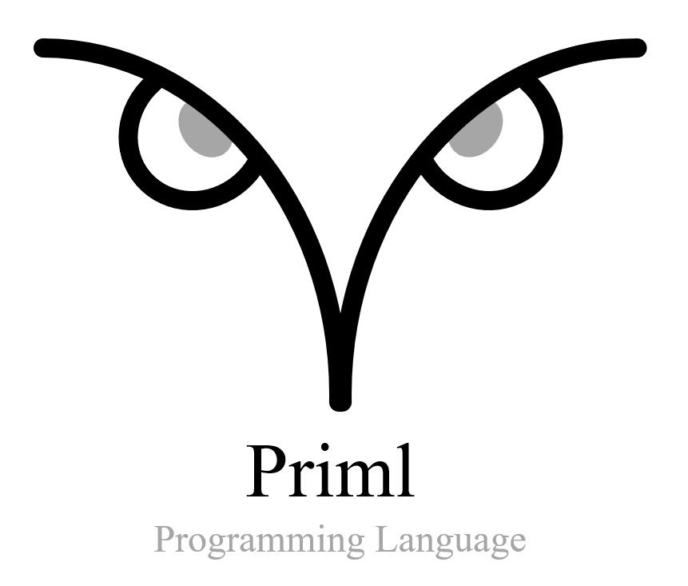

# Priml Programming Language

- [Priml Programming Language](#priml-programming-language)
  - [Introduction](#introduction)
  - [Learn more about Priml](#learn-more-about-priml)
  - [Building the compiler](#building-the-compiler)
    - [On Windows:](#on-windows)
    - [On Linux:](#on-linux)
  - [Running the compiler](#running-the-compiler)
  - [The unit.yaml file](#the-unityaml-file)


## Introduction
Priml (pronounced 'primal') is a new programming language aimed at facilitating systems and AI infrastructure development.

The design of the Priml language draws inspiration from C++, Rust, and Swift. Personally, I hold Rust and Swift in high regard as excellent programming languages, while my relationship with C++ is more of a love-hate one (you can read my [C++ rant](doc/cppthoughts.md)). Many of us who were C programmers decades ago initially viewed C++ as "C with classes". While there have been some positive developments, C++ has largely declined. The language has become incredibly complex and error-prone due to the influence of C++ elitists and standards committees, and useful features for safety, security, or package management have not been added. To this day, there is no % format specifier available for printing strings in C++.

>*"Speaking of languages, it's time to halt starting any new projects in C/C++ and use Rust for those scenarios where a non-GC language is required. For the sake of security and reliability. the industry should declare those languages as deprecated"* -- Mark Russinovich

Good advice from Mark but giving up C/C++ also gives up a lot of good concepts (the usable core concepts). As I mentioned, Rust is excellent but has a many new concepts, limitations, and frankly some very strange syntax.

What if there was a language that can take the core good C/C++ concepts and none of the bad stuff, good concepts from Rust/Swift, and a incredibily easy to learn and clean syntax?  **That is the design of Priml.**

## Learn more about Priml

- [Docs](doc/lang.md)
- [Samples](samples)

## Building the compiler
Building the compiler requires a few dependencies. They are listed here with instructions on how to install on Linux and Windows:

[Dependencies Setup](doc/setup.md)

After installing the dependencies, you can build the compiler from the source code. Following scripts are provided to make it easy to build and install the compiler.

| Scripts | |
| - | - |
| cm.sh cm.cmd | Configures the CMake files to build using Ninja and CLang. Only need to run once |
| bld.sh bld.cmd | Builds the compiler and tests. Can specify 'Debug' (default), 'Release', 'RelWithDebInfo' or 'MinSizeRel'  |
| install.sh install.cmd | Installs the compiler.  Must be run from "Administrative" prompt |

### On Windows:
```cmd
git clone https://github.com/primllang/pc.git
cd pc
script\cm.cmd
script\bld.cmd
script\install.cmd
```
### On Linux:
```bash
git clone https://github.com/primllang/pc.git
cd pc
chmod +x script/*.sh
script/cm.sh
script/bld.sh
script/install.sh
```
## Running the compiler
See usage:
```
pc -?
Usage:
    new <unit> [--exe or --lib] [--nogit]
    build [<unit>] [<build type>]
    run [<unit>] [<build type>]
    clean <units> ...

Build types:
    --debug
    --release
    --relwithdeb

Other options:
    --verbose
    --cleanfirst
    --hard
    --checkdeps
    --diagfiles
    --savetemps
    --config <configfile>
    -?, --help
```
Create a new executable **unit** and initialize the git repo (default):
```
pc new --exe myexe
```
Create a new library **unit** with without git:
```
pc new --lib mylib --nogit
```
Build a **unit** by specifying the name of the directory where the unit is stored. If the directory is ommited, current directory is used.  By default this builds the debug build type:
```
pc build myexe
```
Build a release build:
```
pc build myexe --release
```
Run the release build type of an executable **unit** using pc tool.
```
pc run myexe --release
```
## The unit.yaml file
Each unit has a yaml file that describes the unit, source files and  dependencies, and extended libraries written in cpp.
```yaml
unit:
  name: helloworld
  type: exe
  version: 0.1.1
  edition: 2023
src:
  - main.pc
deps:
  - base:
      namespace: global
ext:
```


